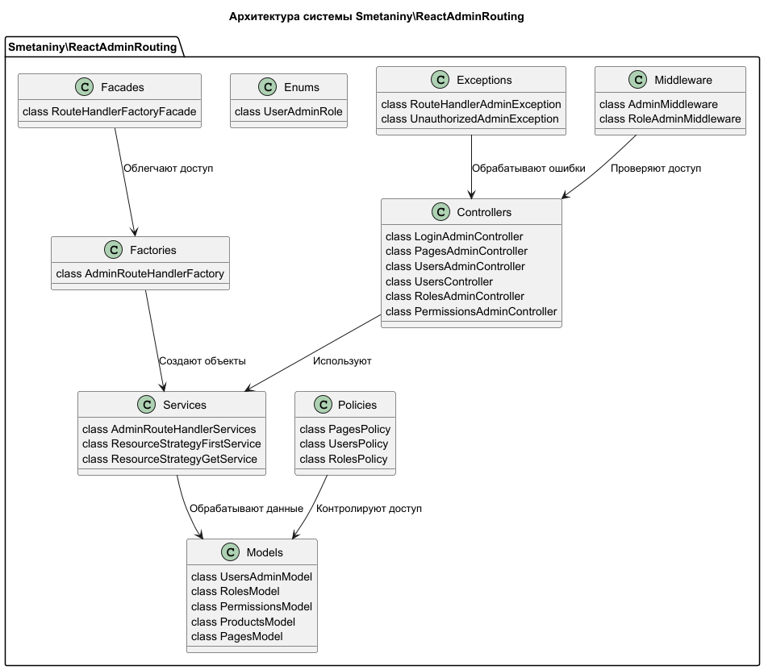

# ReactAdminRouting

## 1. Описание системы

Пакет `Smetaniny\ReactAdminRouting` предназначен для управления маршрутами в административной панели на базе React и
Laravel. Он включает компоненты для работы с ролями, правами доступа, обработкой запросов, политиками доступа,
стратегиями отображения данных, а также предоставляет возможность гибкой настройки через middleware, фасады и сервисы.

Система обеспечивает надежное управление и доступ к административным функциям, включая аутентификацию, авторизацию и
управление ресурсами.

## 2. Основные компоненты системы

### Controllers (Контроллеры)

Контроллеры управляют маршрутами и логикой взаимодействия с административной панелью. Каждый контроллер отвечает за
определенную часть функциональности:

- **LoginAdminController** — обработка входа в административную панель.
- **PagesAdminController** — управление страницами админ-панели.
- **UsersAdminController** и **UsersController** — управление пользователями.
- **RolesAdminController** — управление ролями.
- **PermissionsAdminController** — управление правами доступа.
- **GroupPermissionAdminController** — управление группами разрешений.

### Models (Модели)

Модели представляют таблицы базы данных и обеспечивают связь данных с логикой приложения. Основные модели:

- **UsersAdminModel**, **RolesModel**, **PermissionsModel** — управление пользователями, ролями и правами доступа.
- **ProductsModel**, **PagesModel** — работа с продуктами и страницами в административной части.
- **GroupPermissionModel** — управление группами разрешений.

### Middleware (Промежуточное ПО)

Middleware фильтрует запросы и обеспечивает проверку ролей и прав доступа:

- **AdminMiddleware** — проверка доступа к админке.
- **RoleAdminMiddleware** — управление ролями при доступе к ресурсам.

### Enums (Перечисления)

Классы с перечислениями ролей пользователей, такие как `UserAdminRole`, используются для явного определения ролей в
системе:

- **ADMIN**
- **EDITOR**
- **VIEWER**

### Services (Сервисы)

Сервисы реализуют логику работы с маршрутами и отображением ресурсов:

- **AdminRouteHandlerServices** — управление маршрутами админ-панели.
- **ResourceShowService** — реализация логики для отображения ресурсов.
- **ResourceStrategyFirstService**, **ResourceStrategyGetService** — стратегии отображения данных.

### Factories (Фабрики)

Фабрики создают объекты, необходимые для работы с маршрутами:

- **AdminRouteHandlerFactory** — создание обработчиков маршрутов для админки.

### Policies (Политики)

Политики доступа контролируют, какие действия могут выполняться пользователями в зависимости от их ролей:

- **PagesPolicy** — политика для управления страницами.
- **UsersPolicy** — политика для управления пользователями.
- **RolesPolicy** — политика для управления ролями.
- **PermissionsPolicy** — политика для управления правами доступа.
- **GroupPermissionPolicy** — политика для управления группами разрешений.

### Exceptions (Исключения)

Классы для обработки ошибок:

- **RouteHandlerAdminException** — ошибка маршрутизации в админке.
- **UnauthorizedAdminException** — ошибка авторизации.
- **ResourceNotFoundException** — ошибка, связанная с отсутствием запрашиваемого ресурса.

### Facades (Фасады)

Фасады предоставляют упрощенный интерфейс для работы с фабриками:

- **RouteHandlerFactoryFacade** — фасад для работы с фабрикой маршрутов.

## 3. Требования

### Функциональные требования

- **Аутентификация и авторизация**: Пользователи могут входить в административную панель, при этом система проверяет их
  роль (Admin, Editor, Viewer).
- **Управление ролями и разрешениями**: Поддержка CRUD-операций для ролей и прав доступа.
- **Маршрутизация и доступ к ресурсам**: Использование middleware для защиты маршрутов и проверки прав доступа.
- **Политики безопасности**: Использование политик для контроля доступа к различным моделям и функциональности.
- **Гибкая система обработки запросов**: Использование стратегий для отображения данных и выполнения запросов.

### Нефункциональные требования

- **Расширяемость**: Возможность легко добавлять новые роли, модели и политики без изменения существующего кода.
- **Производительность**: Эффективное управление запросами и рендеринг данных через стратегии отображения.
- **Безопасность**: Контроль доступа к административным ресурсам через middleware и политики.

## 4. Дизайн системы

### Архитектурный стиль

Используется архитектурный стиль **MVC (Model-View-Controller)**. Контроллеры обрабатывают запросы, модели
взаимодействуют с базой данных, а middleware и политики контролируют доступ к данным.

### Компоненты и взаимодействия

- **Controllers** — принимают запросы от пользователя, обрабатывают их и взаимодействуют с моделями или сервисами для
  получения данных.

  Пример: `PagesAdminController` обрабатывает запросы на управление страницами админки, используя модели и политики для
  проверки доступа.

- **Models** — представляют данные и взаимодействуют с базой данных. Например, `UsersAdminModel` управляет данными
  пользователей, их ролями и правами доступа.

- **Middleware** — обрабатывает запросы до передачи их контроллерам, проверяя, имеет ли пользователь необходимые права
  доступа.

- **Services** — содержат бизнес-логику и обрабатывают сложные запросы. Сервисы, такие как `AdminRouteHandlerServices`,
  отвечают за работу с маршрутами в административной панели.

- **Policies** — проверяют права доступа пользователя на выполнение определенных действий.

- **Factories и Facades** — фабрики создают объекты, необходимые для работы с маршрутами и обработкой данных, а фасады
  упрощают доступ к этим объектам.

## 5. Технологический стек

- **PHP 8+**
- **Laravel 9+** — основной фреймворк для разработки.
- **React.js** — для фронтенда административной панели.
- **MySQL/PostgreSQL** — для хранения данных пользователей, ролей и других моделей.
- **Docker** (по желанию) — для контейнеризации приложения и управления окружением разработки.

## 6. Заключение

Пакет `Smetaniny\ReactAdminRouting` предоставляет комплексную архитектуру для управления административной панелью с
гибкой системой маршрутизации и контроля доступа. Система разделена на несколько слоев, что обеспечивает хорошую
масштабируемость и расширяемость. Обширная поддержка политик, ролей и прав доступа делает систему безопасной и
эффективной для управления административными функциями.

## Архитектура системы

## Структура



## Установка

Установите через Composer:

```bash
composer require smetaniny/react-admin-routing
```

## Тестирование

```bash
composer test
```
